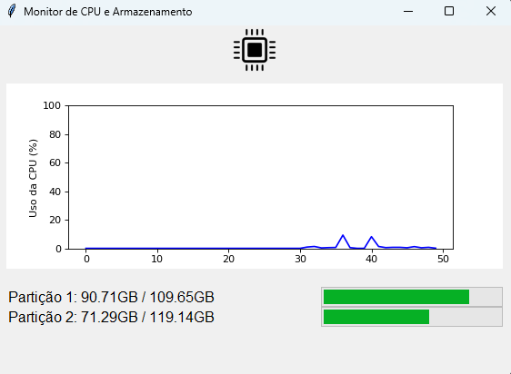
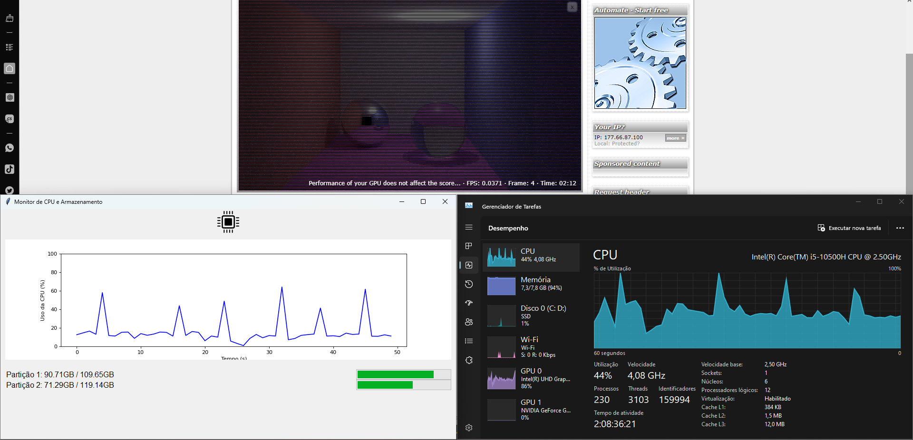
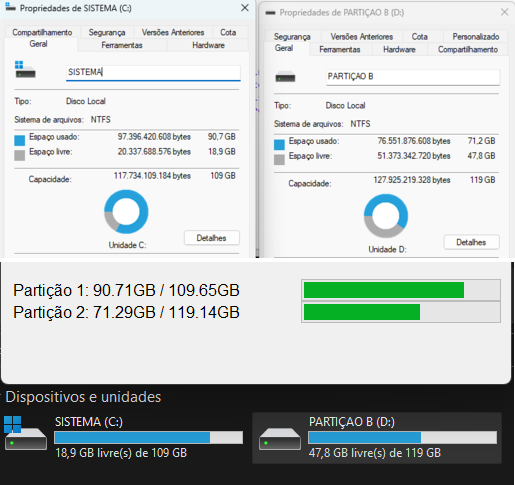

# Monitor de CPU e Armazenamento em Tempo Real (windows)

Este é um projeto de monitoramento em tempo real da CPU e do armazenamento do sistema com uma interface gráfica simples e amigável em Python.



## Funcionalidades

- Monitoramento do uso da CPU em tempo real.
- Exibição do uso de armazenamento de todas as partições.
- Gráfico interativo de uso da CPU.
- Atualizações automáticas a cada segundo.

## Requisitos

- Python 3.x
- Bibliotecas Python: tkinter, PIL, psutil, matplotlib

## Como Usar

1. Clone este repositório:

   ```shell
   git clone https://github.com/merlin-ribeiro/monitorcpupython.git
   cd monitorcpupython

2. Execute o programa:

   ```shell
   python monitor.py

 ### ou

1. Baixe o arquivo `monitor.exe`
   
2. Execute o arquivo em sua máquina

## Screenshots

 


## Contribuições

Sinta-se à vontade para contribuir com melhorias, correções ou novos recursos para este projeto.

## Licença

Este projeto é licenciado sob a [Licença MIT](LICENSE).

**Desenvolvido por Merlin Rbeiro (https://github.com/merlin-ribeiro)**
